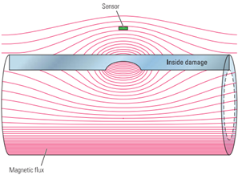

# Pipe failure detection

In the following repository you can find machine learning approache of defect location of metal pipes. 
There are 245 measurements (magnetic flaw detection) of metal pipes with different defect types (for example - corrosion, scratch, etc).

For each measurement the following info is available:

        id - measurement identificator;
        time - measurement time, sec.;
        ch0, ch1, ch2 - recordings from three channels over pipe length.
        target - external (OD) or internal (ID) type of defect.

